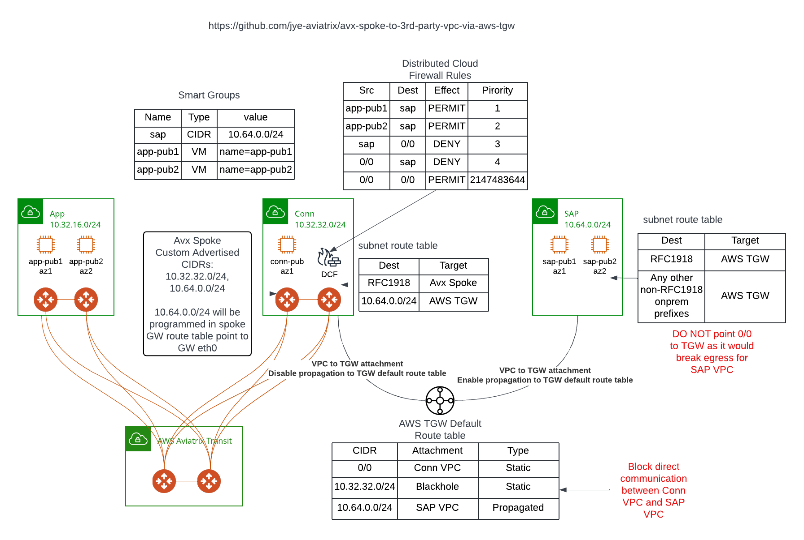

# Connect Aviatrix to 3rd Party VPC via AWS TGW

- 3rd party owned VPC, cannot deploy Aviatrix Spoke. Shown in below diagram as Sap 10.64.0.0/24
- Need to have a way to connect to Aviatrix and also utilize Distributed Cloud Firewall on Aviatrix Spoke to protect the traffic



- In this architecture, left side has an App Aviatrix Spoke VPC 10.32.16.0.24
- App VPC need to talk to SAP VPC
- Nothing else should be able to talk to SAP VPC, and SAP VPC cannot initiate inbound traffic towards Aviatrix side.

## Connectivity
- Conn Aviatrix Spoke VPC will use AWS TGW to connect to SAP VPC
- Conn Aviatrix Spoke VPC will perform Custom Spoke Advertised CIDR of both 10.32.32.0/24 and 10.64.0.0/24, so rest of Aviatrix network would know SAP 10.64.0.0/24 would go through Conn Avx Spoke
- Unmanaged AWS TGW is created with default route table
- Conn Avx Spoke VPC is attached to AWS TGW
- SAP VPC is also attached to AWS TGW
- On Conn Avx Spoke VPC subnet route tables, Aviatrix insert RFC1918 point to Conn Spoke GW. We also add 10.64.0.0/24 to the route table point to AWS TGW
- On SAP VPC subnet route tables, we added 10/8 (or whatever the Customer Cloud/OnPrem CIDR needs to be) point to AWS TGW
- In AWS TGW default route table, add static 0/0 point to Conn VPC attachment

## Distributed Cloud Firewall (DCF)
- Create smart groups for app-pub1 and app-pub2 VMs using name tag
- Create smart group for sap using CIDR 10.64.0.0/24
- Create Distributed Firewall Policies in following order
    - Allow app-pub1 talk to sap
    - Allow app-pub2 talk to sap
    - Deny inbound traffic from sap
    - Deny outbound traffic to sap
    - Allow any to any

### NOTE: Statefullness of Aviatrix DCF

If you do SNI or URL filtering or IDS, DCF if stateful. If you are just filtering based on IP addresses, ports, and protocols it is not stateful.

This is important to consider, as the traffic to SAP would leave from primary GW eth0, but return via HA GW eth0. If using SNI/URL filtering/IDS, then we must SNAT the traffic to GW eth0 to ping it to a specific gateway.

# WARNING
!!! Only run this in your test environment. Existing DCF policy will be OVERWRITTEN!!!

## Testing
- confirm iperf3 is install on test nodes
- On sap-pub1 and sap-pub2, launch iperf3 as server by using: ```iperf3 -s```
- On app-pub1 and app-pub2, try to connect to sap using iperf3 by running ```iperf3 -P 10 -c {sap_pub_ip}```, replace {sap_pub_ip} with the IP address of sap-pub1 or sap-pub2.
- Iperf3 test uses TCP and it helps to validate if we have asymetric issue. Don't use ping as ICMP isn't stateful.
- You can perform the reverse test from sap-pub1/2 back towards app-pub1/2, and confirm they are indeed been blocked.
- conn-pub and sap-hub1/2 has unrestricted access, as the traffic doesn't go through Aviatrix Spoke, it goes via AWS TGW.